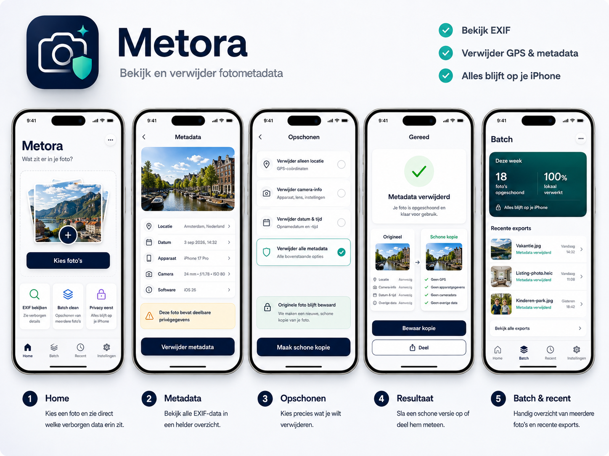

# Metora — React Native / Expo Build Specification

> **Build this app with React Native + Expo + TypeScript. Do not build it in SwiftUI.**
>
> Development happens on **Windows**. iOS builds must be produced in the cloud with **EAS Build**.
>
> The supplied `metora-design-board.png` is the visual reference for layout, hierarchy, spacing, colors, and overall feel. **Ignore the Dutch text in the image. All user-facing copy in the real app must be English and the English copy in this document is the source of truth.**

---

## 1. Product Summary

**App name:** Metora  
**Platform:** iPhone first  
**Framework:** React Native  
**Tooling:** Expo + TypeScript  
**Navigation:** Expo Router  
**Development OS:** Windows  
**iOS build system:** EAS Build  
**Language in v1:** English only  
**Primary launch market:** Canada  
**Next markets:** Australia, United Kingdom, United States, Netherlands  
**Business model:** one-time lifetime purchase  
**Target price:** approximately 9.99 in the local App Store currency / price tier  
**Free tier:** none  
**Trial:** none  
**Subscription:** none  
**Ads:** none  
**Account:** none  
**Custom backend:** none  
**Photo processing:** fully on-device

### Core promise

> **See what is hidden in your photos. Remove it before you share.**

Metora is a small premium privacy utility. A user selects one or more photos, sees the metadata stored inside them, removes privacy-sensitive metadata, and saves or shares a clean copy.

The original photo is never modified.

### Product positioning

Metora is **not** a photo editor.

It is a premium utility built around one job:

> **Inspect → Clean → Save or Share**

The app should feel trustworthy, quiet, fast, and obvious within seconds of opening it.

---

## 2. Hard Product Rules

These are non-negotiable for v1.

1. Build with **React Native + Expo + TypeScript**.
2. Do not create a SwiftUI app.
3. Do not write custom Swift / Objective-C code unless the owner explicitly approves it later.
4. Existing Expo-compatible native packages are allowed.
5. No account creation.
6. No subscription.
7. No ads.
8. No free usable version.
9. No server-side photo upload.
10. No cloud AI.
11. No analytics SDK in v1.
12. Photos must never be uploaded by Metora.
13. The original photo must never be modified or deleted automatically.
14. Cleaning always creates a new file.
15. Every cleaned output must be verified before it is presented as clean.
16. Never claim metadata was removed unless post-export verification succeeds.
17. No filters, cropping, retouching, album management, social features, or general photo editing.
18. Keep the interface visually close to the supplied design board.
19. All user-facing text is English.
20. Favor simplicity over feature count.

---

## 3. Windows Development Strategy

The project is developed on Windows, so do not assume local access to Xcode or the iOS Simulator.

### Required development model

Use:

- Node.js LTS
- npm or pnpm
- React Native
- Expo
- TypeScript with strict mode
- Expo Router
- EAS CLI
- EAS Build for iOS
- a physical iPhone for final device testing

### Important constraint

Most UI development can be done on Windows using Expo / Android / web previews where useful, but **real iOS behavior must be validated on an iPhone development build**.

Features such as real App Store purchases require a development build and cannot be considered tested only through Expo Go.

### Recommended project bootstrap

```bash
npx create-expo-app@latest metora
cd metora
npx expo install expo-dev-client
npm install -g eas-cli
eas login
eas build:configure
```

Use the current stable Expo SDK at the time the project is created. Do not pin to an old SDK just because it appears in an example.

### iOS build from Windows

Use EAS:

```bash
eas build --platform ios --profile development
```

For production:

```bash
eas build --platform ios --profile production
```

The developer should not require a Mac for normal coding. EAS performs the iOS build on remote macOS infrastructure.

---

## 4. Suggested Technology Stack

Before installing packages, Claude must check their current Expo compatibility and use the latest stable compatible versions.

### Core

```text
react-native
expo
typescript
expo-router
```

### Photo selection and storage

Preferred Expo packages:

```text
expo-image-picker
expo-media-library
expo-file-system
expo-image-manipulator
expo-sharing
```

### Metadata inspection

Preferred first choice:

```text
exifreader
```

Reason:

- JavaScript / TypeScript library
- works with React Native when supplied file bytes
- supports common metadata families
- supports JPEG, PNG and HEIC inspection
- avoids writing a custom iOS metadata reader

If a compatibility problem appears, evaluate `exifr` as the fallback.

### Payments

Preferred solution:

```text
react-native-purchases
```

Use RevenueCat only as the purchase / entitlement layer. Metora itself has no custom backend.

Reasons:

- reliable StoreKit wrapper for React Native
- one-time non-consumable entitlement support
- purchase restoration
- receipt / entitlement handling without us implementing a purchase server
- works with Expo development builds

**Do not send photos, filenames, metadata, or photo content to RevenueCat.** RevenueCat is only for purchase state.

### UI helpers

Use native React Native components first. Keep third-party UI frameworks out unless they solve a real problem.

Allowed Expo packages when useful:

```text
expo-haptics
expo-symbols (if stable and appropriate for iOS symbols)
expo-blur (only sparingly)
expo-linear-gradient (only where the board calls for it)
```

Do not add a heavy design-system dependency.

---

## 5. Monetization — Hard Lifetime Paywall

Metora has **no functional free tier**.

The app itself can be downloaded from the App Store, but the metadata tools are inaccessible until the user purchases the lifetime unlock.

### Purchase model

Create one iOS non-consumable product in App Store Connect.

Suggested product id:

```text
metora_lifetime
```

Suggested RevenueCat entitlement:

```text
metora_pro
```

Suggested offering:

```text
default
```

### Price

Target approximately:

```text
$9.99 / €9.99 / equivalent local App Store tier
```

Do **not** hard-code `$9.99` into the UI.

Always display the localized product price returned by the store / RevenueCat.

### First-launch behavior

```text
App opens
  ↓
Check lifetime entitlement
  ↓
Unlocked? ── yes ──> Home
  │
  no
  ↓
Hard Paywall
```

The user cannot reach the actual photo picker or metadata tools while locked.

### Paywall copy

#### Headline

**Your photos reveal more than you think.**

#### Supporting text

**View hidden photo metadata and remove private details before you share. Everything is processed on your iPhone.**

#### Benefits

- View EXIF and hidden metadata
- Remove GPS, device and camera details
- Clean multiple photos
- 100% on-device processing
- No ads
- No subscription

#### Product line

**Metora Lifetime**

Dynamic localized store price followed by:

**One purchase. Yours forever.**

#### Primary CTA

**Unlock Metora**

#### Secondary CTA

**Restore Purchase**

#### Trust line

**No subscription. No ads. No account.**

### Purchase behavior

Create a `PurchaseService` that exposes at minimum:

```ts
interface PurchaseService {
  isUnlocked: boolean;
  isLoading: boolean;
  productPrice?: string;
  loadEntitlement(): Promise<void>;
  purchaseLifetime(): Promise<void>;
  restorePurchases(): Promise<void>;
}
```

Requirements:

- entitlement is checked at launch
- purchase completion unlocks immediately
- cancelled purchase does not show a scary error
- failed purchase shows a clear retry state
- restore works from the paywall and Settings
- do not grant permanent access from an AsyncStorage boolean alone
- RevenueCat entitlement / App Store purchase state is the authority

---

## 6. Visual Source of Truth

The supplied file:

```text
metora-design-board.png
```

is the **visual source of truth**.



### Very important

The design board currently contains Dutch labels.

**Do not copy those words into the app.**

Use the board only for:

- overall composition
- hierarchy
- spacing
- card shapes
- color relationship
- navigation placement
- button placement
- visual density
- icon treatment
- premium / minimal feeling

The exact English strings in this document are the copy source of truth.

### Design personality

Metora should feel:

- premium
- minimal
- privacy-first
- trustworthy
- modern
- calm
- iPhone-native
- fast
- understandable without instructions

Avoid:

- cyberpunk / hacker aesthetics
- black-and-neon privacy clichés
- excessive gradients
- glass everywhere
- giant walls of EXIF tags
- ads
- banners
- pop-ups
- gamification
- unnecessary animation
- over-designed navigation

---

## 7. Design System

Create centralized theme tokens. Do not scatter raw values throughout components.

Suggested file structure:

```text
src/theme/colors.ts
src/theme/spacing.ts
src/theme/radius.ts
src/theme/typography.ts
src/theme/shadows.ts
```

### Colors

Starting values:

```ts
export const colors = {
  navy900: '#071B3C',
  navy800: '#0B2A58',
  teal500: '#18B7A5',
  green500: '#27B45E',
  background: '#F7F9FC',
  card: '#FFFFFF',
  textPrimary: '#0B1833',
  textSecondary: '#667085',
  divider: '#E7EBF2',
  warningBackground: '#FFF6DC',
  warningText: '#8A5A00',
  successBackground: '#EAF8EF',
  danger: '#D92D20',
};
```

### Spacing scale

Use a simple 4-point base:

```text
4, 8, 12, 16, 20, 24, 32, 40
```

Standard horizontal screen padding:

```text
20
```

### Corner radii

```text
Small:   10
Medium:  14
Card:    18
Large:   22
Button:  15
Pill:    999
```

### Typography

Use the system font.

Recommended hierarchy:

```text
Brand / hero title: 34–40, bold
Screen title:       22–28, bold
Card heading:       16–18, semibold
Body:               15–17, regular
Secondary:          13–15
Caption:            11–13
```

Support Dynamic Type where practical.

### Shadows

Keep subtle:

- low opacity
- small blur
- low vertical offset
- do not shadow every list row

### Haptics

Use `expo-haptics` for:

- successful clean
- successful purchase
- selected cleaning option
- important failure

No haptic spam.

---

## 8. Information Architecture

After purchase, use four bottom tabs:

1. **Home**
2. **Batch**
3. **Recent**
4. **Settings**

Keep the same navigation idea as the design board.

Suggested route structure with Expo Router:

```text
app/
  _layout.tsx
  paywall.tsx
  (tabs)/
    _layout.tsx
    index.tsx          # Home
    batch.tsx
    recent.tsx
    settings.tsx
  photo/
    [id].tsx           # Metadata detail
    clean.tsx          # Cleaning options
    result.tsx         # Success / export
```

Do not force the exact filenames if a cleaner architecture emerges, but keep the flow simple.

### Main single-photo flow

```text
Home
  ↓
System Photo Picker
  ↓
Metadata
  ↓
Clean Up
  ↓
Processing + Verification
  ↓
Done
  ↓
Save Copy / Share
```

---

## 9. Screen 0 — Hard Paywall

This is the first functional screen for a locked user.

### Layout

Top section:

- Metora app icon
- `Metora`
- privacy-focused hero visual based on the same navy / teal brand system

Main copy:

**Your photos reveal more than you think.**

**See hidden metadata. Remove private details. Share a clean copy.**

Benefit rows:

- **View hidden EXIF data**
- **Remove GPS & device details**
- **Batch clean photos**
- **Everything stays on your iPhone**

Product card:

```text
Metora Lifetime
{localized price}
One purchase. Yours forever.
```

Primary button:

**Unlock Metora**

Secondary text button:

**Restore Purchase**

Footer:

**No subscription · No ads · No account**

The screen should feel premium, not aggressive.

---

## 10. Screen 1 — Home

Follow phone 1 from the design board.

### English copy

Brand title:

**Metora**

Subtitle:

**What is hidden in your photo?**

Main picker card:

- layered photo illustration / recent neutral placeholder
- large plus button

Primary CTA:

**Choose Photos**

Feature cards below:

#### Card 1

**View EXIF**  
See hidden photo details

#### Card 2

**Batch Clean**  
Clean multiple photos

#### Card 3

**Privacy First**  
Everything stays on your iPhone

### Behavior

Tapping **Choose Photos** opens the native photo picker.

For a single selection:

```text
Home → Metadata Detail
```

For multiple selection:

```text
Home → Batch
```

Do not request full photo-library permission if the system picker can provide the required selected assets with less access.

Request only the minimum permission needed for each operation.

---

## 11. Screen 2 — Metadata Detail

Follow phone 2 from the board.

### Title

**Metadata**

### Photo preview

Large rounded preview near the top.

### Summary rows

Show human-readable metadata categories first, not a giant raw EXIF dump.

Example:

```text
Location       Amsterdam, Netherlands
Captured       Sep 3, 2026 · 2:32 PM
Device         iPhone
Camera         24 mm · ƒ/1.8 · ISO 80
Software       iOS
```

Only show rows when data exists.

### Sensitive information warning

If privacy-sensitive fields exist, show a pale warning card:

**This photo contains shareable private data**

Supporting text:

**Location, capture time, or device details may travel with the original file.**

### Primary button

**Remove Metadata**

### Optional disclosure

A row called:

**View All Metadata**

may expand to show technical EXIF fields for power users.

Keep it collapsed by default.

---

## 12. Screen 3 — Clean Up

Follow phone 3 from the design board.

### Title

**Clean Up**

### Options

Use large selectable cards.

#### Option

**Remove location only**  
GPS coordinates

#### Option

**Remove camera info**  
Device, lens and camera settings

#### Option

**Remove date & time**  
Capture date and timestamp

#### Recommended option

**Remove all metadata**  
Remove all removable metadata

Default selection:

**Remove all metadata**

### Trust card

Lock icon.

**Your original photo stays untouched**

**Metora creates a new clean copy.**

### Primary CTA

**Create Clean Copy**

---

## 13. Screen 4 — Processing

This can be a short transitional state rather than a separate route.

Do not fake progress percentages unless real progress is known.

Show:

```text
Cleaning photo…
```

then:

```text
Verifying metadata…
```

For batch:

```text
Cleaning 4 of 12
```

The app must not move to Done until verification passes.

---

## 14. Screen 5 — Done / Result

Follow phone 4 from the board.

### Success state

Large green check.

**Metadata Removed**

**Your clean copy is ready to save or share.**

### Comparison

Show:

#### Original

- Location: Present
- Camera info: Present
- Capture time: Present

only for fields that were actually present.

Arrow →

#### Clean Copy

- No GPS
- No device details
- No camera metadata
- No capture metadata

Only claim each item when verified.

### Primary CTA

**Save Copy**

### Secondary CTA

**Share**

### Important behavior

Saving must create a new item. Never replace the original automatically.

---

## 15. Screen 6 — Batch

Follow phone 5 from the design board, simplified where necessary.

### Title

**Batch**

### Empty state

**Clean multiple photos at once**

**Choose photos and remove metadata from all of them in one pass.**

CTA:

**Choose Photos**

### When photos are selected

Show a compact grid or list:

```text
12 photos selected
```

Cleaning option:

**Remove all metadata** by default.

CTA:

**Clean 12 Photos**

### Result summary

```text
12 photos cleaned
12 verified
0 failed
```

If any fail, do not silently ignore them.

Show exactly which items failed and allow Retry.

---

## 16. Screen 7 — Recent

Keep this intentionally lightweight.

### Title

**Recent**

Store local records of successful actions, not sensitive source metadata.

Example row:

```text
Vacation.jpg
Metadata removed
Today · 2:32 PM
```

Recent records may store:

- sanitized display filename
- timestamp
- output file URI / asset reference when appropriate
- number of removed metadata categories
- success state

Do **not** persist:

- GPS coordinates
- full EXIF dictionaries
- source photo metadata dumps

Include:

**Clear History**

This clears Metora history only. It must not delete photos.

---

## 17. Screen 8 — Settings

Keep minimal.

Sections:

### Purchase

- **Metora Lifetime — Active**
- **Restore Purchase**

### Cleaning

- Default clean mode: All Metadata
- Keep original: always on and non-disableable

### Privacy

- **How Metora handles photos**

Copy:

**Photos are processed on your device. Metora does not upload your photos or metadata to a server.**

### About

- Version
- Privacy Policy
- Terms
- Contact Support

Do not turn Settings into a dumping ground.

---

## 18. Metadata Inspection Architecture

Create a dedicated domain service. UI components must not parse EXIF directly.

Suggested interfaces:

```ts
export type MetadataCategory =
  | 'location'
  | 'captureTime'
  | 'device'
  | 'camera'
  | 'software'
  | 'other';

export interface MetadataSnapshot {
  hasMetadata: boolean;
  location?: {
    latitude?: number;
    longitude?: number;
  };
  capturedAt?: Date;
  make?: string;
  model?: string;
  lensModel?: string;
  focalLength?: string;
  aperture?: string;
  iso?: string | number;
  software?: string;
  raw?: Record<string, unknown>;
}

export interface MetadataService {
  inspect(uri: string): Promise<MetadataSnapshot>;
  verifyClean(uri: string, mode: CleanMode): Promise<VerificationResult>;
}
```

### Metadata display philosophy

Do not expose raw technical tags as the primary interface.

Map them to human language:

```text
GPSLatitude / GPSLongitude → Location
DateTimeOriginal           → Captured
Make + Model               → Device
LensModel / FNumber / ISO  → Camera
Software                   → Software
```

A power-user raw view may exist behind **View All Metadata**.

---

## 19. Cleaning Architecture

Create a separate `PhotoCleaningService`.

Suggested model:

```ts
export type CleanMode =
  | 'location'
  | 'camera'
  | 'dateTime'
  | 'all';

export interface CleanResult {
  outputUri: string;
  originalUri: string;
  verified: boolean;
  removedCategories: MetadataCategory[];
  outputFormat: 'jpeg' | 'png' | 'other';
}
```

### v1 implementation principle

The first release should prioritize **reliable privacy cleaning** over lossless format preservation.

A straightforward v1 path is:

1. Read original metadata.
2. Decode / render the image locally.
3. Write a new image file without copying source metadata.
4. Re-read the output with `ExifReader`.
5. Verify the requested sensitive fields are absent.
6. Only then mark the export as clean.

Use `expo-image-manipulator` or the best current Expo-compatible local image pipeline for the re-export.

### HEIC behavior

HEIC must be inspectable when possible.

If the Expo-compatible JavaScript / native package stack cannot safely rewrite HEIC metadata while preserving HEIC without custom Swift code, then v1 may create the cleaned copy as a high-quality JPEG.

If that happens:

- tell the user the clean copy is JPEG
- preserve the original HEIC untouched
- never silently pretend the format was preserved

Do **not** write a custom Swift HEIC metadata module in v1 without approval.

### Future optimization

A later version may add a lossless metadata-strip path for JPEG so the compressed image payload can remain untouched.

That optimization is not allowed to block the v1 launch.

---

## 20. Verification — Critical Requirement

This is one of the most important parts of Metora.

After creating a clean copy:

```text
output file
   ↓
MetadataService.inspect(output)
   ↓
compare with requested CleanMode
   ↓
verified? → Done
failed?   → Error / Retry
```

### Example

If the user selected **Remove location only**:

Verification must confirm GPS data is gone.

Camera data may remain.

If the user selected **Remove all metadata**:

Verification must confirm all removable EXIF / GPS / relevant XMP privacy fields that the app promises to remove are absent.

Do not use file-size changes as proof of cleaning.

---

## 21. Privacy and Data Handling

Metora's privacy promise is part of the product.

### Never upload

Never upload:

- selected photos
- cleaned photos
- thumbnails
- EXIF metadata
- GPS coordinates
- filenames

### Local temporary files

Temporary processing files should be created in app-local cache storage and removed when they are no longer needed.

Create a cleanup routine for stale temporary files.

### Logs

Do not log raw EXIF dictionaries or GPS coordinates to production console / remote logs.

Development logging must be easy to disable for production.

### Permissions

Use the minimum-access iOS system picker where possible.

Explain permissions honestly.

Do not ask for the user's whole photo library on launch.

---

## 22. State Management

Do not add Redux unless complexity genuinely requires it.

Recommended:

- React context for purchase / entitlement state
- small Zustand store if a global workflow store becomes useful
- local component state for screen-only UI
- AsyncStorage only for non-sensitive settings and recent-action summaries

The image bytes and full EXIF objects should not live in global state longer than required.

Suggested app-level stores:

```text
PurchaseProvider
PhotoWorkflowStore
SettingsStore
```

Keep them small.

---

## 23. Project Structure

Suggested structure:

```text
metora/
├─ app/
│  ├─ _layout.tsx
│  ├─ paywall.tsx
│  ├─ (tabs)/
│  │  ├─ _layout.tsx
│  │  ├─ index.tsx
│  │  ├─ batch.tsx
│  │  ├─ recent.tsx
│  │  └─ settings.tsx
│  └─ photo/
│     ├─ [id].tsx
│     ├─ clean.tsx
│     └─ result.tsx
├─ src/
│  ├─ components/
│  │  ├─ PrimaryButton.tsx
│  │  ├─ MetadataRow.tsx
│  │  ├─ CleanOptionCard.tsx
│  │  ├─ PrivacyCard.tsx
│  │  └─ PhotoPreview.tsx
│  ├─ features/
│  │  ├─ purchase/
│  │  ├─ metadata/
│  │  ├─ cleaning/
│  │  ├─ batch/
│  │  └─ recent/
│  ├─ services/
│  │  ├─ PurchaseService.ts
│  │  ├─ MetadataService.ts
│  │  ├─ PhotoCleaningService.ts
│  │  └─ PhotoLibraryService.ts
│  ├─ stores/
│  ├─ theme/
│  ├─ types/
│  └─ utils/
├─ assets/
│  ├─ icon.png
│  └─ ...
├─ app.config.ts
├─ eas.json
├─ tsconfig.json
└─ package.json
```

Feature folders may contain their own hooks, models and tests.

---

## 24. Reusable UI Components

At minimum create:

### `PrimaryButton`

- dark navy
- white semibold text
- full width
- about 52–56 high
- rounded ~15
- disabled and loading states

### `MetadataRow`

- icon
- title
- value
- optional chevron
- accessible

### `CleanOptionCard`

- icon
- heading
- description
- radio / check indicator
- teal selected border

### `PrivacyCard`

Variants:

```text
warning
success
neutral
```

### `PhotoPreview`

- rounded crop
- correct aspect behavior
- no accidental distortion

### `EmptyStateCard`

Used on Home and Batch.

Do not create an abstract UI framework. Build only what this app uses.

---

## 25. Accessibility

Required:

- meaningful accessibility labels for icon buttons
- sufficient contrast
- minimum practical touch targets
- support font scaling without breaking core screens
- success and failure states must not rely on color alone
- VoiceOver-readable metadata labels and values

Example:

```text
"Location, Amsterdam Netherlands"
```

rather than two unrelated controls.

---

## 26. Error States

Design calm errors.

### Photo cannot be read

**This photo couldn't be opened**

**Try another photo or export a standard copy first.**

### No metadata found

**No removable metadata found**

**This photo already looks clean.**

Do not treat this as a failure.

### Clean export failed

**Couldn't create a clean copy**

**Your original photo was not changed. Please try again.**

### Verification failed

**We couldn't verify this copy**

**Metora won't mark a photo as clean unless it can confirm the metadata is gone.**

CTA:

**Try Again**

### Purchase unavailable

**Metora Lifetime is temporarily unavailable**

**Please check your connection and try again.**

---

## 27. App Icon Direction

Match the board concept:

- deep navy rounded-square background
- simple camera / photo outline
- one teal privacy cue, such as shield or sparkle
- no text
- must remain recognizable at small App Store icon sizes

The icon should communicate:

```text
photo + privacy
```

not:

```text
antivirus / VPN / hacking
```

---

## 28. English UI Copy — Source of Truth

Use these terms consistently.

| Concept | Exact UI term |
|---|---|
| Home | Home |
| Batch | Batch |
| Recent | Recent |
| Settings | Settings |
| Choose photos | Choose Photos |
| Metadata screen | Metadata |
| Clean screen | Clean Up |
| Remove metadata | Remove Metadata |
| Remove only GPS | Remove location only |
| Remove camera data | Remove camera info |
| Remove timestamp | Remove date & time |
| Remove everything | Remove all metadata |
| Create output | Create Clean Copy |
| Completion title | Metadata Removed |
| Save output | Save Copy |
| Share output | Share |
| Purchase CTA | Unlock Metora |
| Restore | Restore Purchase |
| Lifetime product | Metora Lifetime |

Do not use Dutch copy from the design board.

---

## 29. MVP Scope

### Must ship

- hard lifetime paywall
- restore purchase
- English UI
- photo selection
- single-photo metadata inspection
- human-readable metadata summary
- raw metadata disclosure for interested users
- location detection
- date / time detection
- camera / device metadata detection
- remove location option
- remove camera info option
- remove date / time option
- remove all metadata option
- new-file export
- post-export verification
- save clean copy
- share clean copy
- batch selection and clean
- recent action history
- privacy explanation
- settings
- proper loading and failure states

### Explicitly not in v1

- metadata editing
- manually changing GPS
- manually changing capture date
- map editing
- photo filters
- cropping
- photo retouching
- AI
- Android launch
- Mac app
- iCloud account system
- Metora cloud storage
- user profiles
- subscription
- ads
- trial
- referral system
- analytics dashboard

---

## 30. Testing Requirements

Testing is especially important because the app makes a privacy claim.

### Metadata fixture set

Create test images containing combinations of:

1. JPEG with GPS
2. JPEG without GPS
3. JPEG with camera + timestamp metadata
4. PNG with metadata if supported
5. HEIC from an iPhone
6. image with no meaningful metadata
7. very large image
8. malformed / unsupported file
9. photo downloaded from a social platform after metadata has already been stripped

Do not commit private real-world GPS photos to a public repository.

Use controlled fixture files.

### Unit tests

Test:

- metadata normalization
- sensitive category mapping
- clean mode decisions
- verification logic
- purchase entitlement branching
- recent-history sanitation

### Integration tests

Validate:

```text
fixture with GPS
→ clean location
→ inspect output
→ GPS absent
→ camera metadata still allowed to remain
```

and:

```text
fixture with GPS + camera + date
→ clean all
→ inspect output
→ promised metadata categories absent
```

### Device tests

Before shipping, test on at least one real iPhone for:

- photo picker
- HEIC
- saving to Photos
- sharing
- limited photo-library permission
- purchase
- restore
- app reinstall + restore
- batch processing
- large photos

---

## 31. Performance Requirements

The app should feel instant.

Guidelines:

- do not decode full-size images just to inspect EXIF when the parser can read metadata bytes only
- use smaller previews in the UI
- process batch items sequentially or with a conservative concurrency limit to avoid memory spikes
- release buffers as soon as possible
- do not store base64 copies in React state
- use file URIs and binary APIs where possible
- clean temporary files

For a normal single photo, metadata inspection should appear effectively immediate.

---

## 32. Security / Trust Requirements

Because the app is sold as privacy software:

- no ad SDKs
- no tracking SDKs
- no unnecessary network calls
- no photo upload endpoints
- do not include third-party libraries that upload media silently
- review package permissions before installation
- avoid packages that request broad photo access without need
- production build must not emit sensitive metadata to logs

If adding a dependency changes the privacy surface, document why it is necessary.

---

## 33. Recommended Build Order for Claude Code

Do not try to generate the entire app in one uncontrolled pass.

### Phase 1 — Project foundation

1. Create Expo TypeScript project.
2. Configure Expo Router.
3. Add theme tokens.
4. Add tab navigation shell.
5. Recreate the basic design-board look with static mock data.
6. Confirm it builds on Windows / Android preview.

**Checkpoint:** visual skeleton matches the board.

### Phase 2 — Purchases

1. Configure RevenueCat React Native SDK.
2. Implement `PurchaseService`.
3. Implement hard paywall.
4. Implement entitlement gate.
5. Implement restore purchase.
6. Prepare EAS iOS development build configuration.

**Checkpoint:** locked vs unlocked routing is reliable.

### Phase 3 — Photo selection

1. Integrate native photo picker.
2. Support one or multiple image selection.
3. Display previews.
4. Build temporary workflow model.

**Checkpoint:** real photos can enter the workflow.

### Phase 4 — Metadata inspection

1. Add ExifReader.
2. Read file bytes safely.
3. Normalize tags.
4. Build Metadata Detail UI with real data.
5. Add privacy-sensitive warning.

**Checkpoint:** JPEG + iPhone HEIC metadata is correctly displayed on a real iPhone.

### Phase 5 — Cleaning engine

1. Implement local clean-copy pipeline.
2. Implement each clean mode.
3. Never overwrite original.
4. Implement post-export verification.
5. Add clear errors when verification fails.

**Checkpoint:** test fixtures prove the requested metadata is gone.

### Phase 6 — Save and Share

1. Save verified output to photo library.
2. Share verified output.
3. Show Done screen.
4. Add haptic success.

### Phase 7 — Batch

1. Multi-select.
2. Queue processing.
3. Per-photo success / failure.
4. Batch summary.

### Phase 8 — Recent and Settings

1. Store sanitized action records.
2. Recent screen.
3. Clear History.
4. Settings / privacy explanation / restore.

### Phase 9 — Polish

1. Match spacing and visual hierarchy to the design board.
2. Accessibility pass.
3. Loading states.
4. Empty states.
5. Error-state polish.
6. Haptics.
7. App icon / splash.

### Phase 10 — iOS release validation

1. EAS production build.
2. TestFlight.
3. Physical iPhone purchase tests.
4. Restore tests.
5. Privacy checks.
6. Metadata fixture verification.
7. App Store screenshots / listing.

---

## 34. Definition of Done

Metora v1 is done when all of these are true:

- [ ] React Native + Expo + TypeScript project builds successfully
- [ ] development can be performed from Windows
- [ ] EAS produces a working iOS build
- [ ] all user-facing copy is English
- [ ] design visually follows `metora-design-board.png`
- [ ] Dutch copy from the board never appears in the app
- [ ] locked users cannot use core features
- [ ] lifetime purchase unlocks the app
- [ ] purchase restoration works
- [ ] one photo can be selected
- [ ] multiple photos can be selected
- [ ] metadata can be inspected
- [ ] location is identified when present
- [ ] capture date is identified when present
- [ ] camera / device information is identified when present
- [ ] all defined clean modes work
- [ ] original files are never overwritten
- [ ] every output is verified
- [ ] failed verification is never presented as success
- [ ] clean copy can be saved
- [ ] clean copy can be shared
- [ ] batch flow handles partial failures
- [ ] sensitive source metadata is not persisted in history
- [ ] no photo data is uploaded
- [ ] no ads exist
- [ ] no subscription exists
- [ ] no account exists
- [ ] production logs do not expose metadata / GPS
- [ ] app is tested on a real iPhone

---

## 35. Claude Code Operating Instructions

When executing this specification:

1. Read this entire document before editing code.
2. Treat the English copy in this file as authoritative.
3. Treat `metora-design-board.png` as visual inspiration only.
4. Build in React Native / Expo / TypeScript.
5. Do not convert the project to SwiftUI.
6. Do not write custom Swift / Objective-C without explicit approval.
7. Before adding a package, verify current Expo compatibility and maintenance status.
8. Prefer official Expo packages where practical.
9. Keep photo processing local.
10. Do not upload photos during development or production.
11. Implement one phase at a time.
12. Run lint / typecheck / tests after meaningful changes.
13. Do not add features outside the MVP because they seem useful.
14. When an iOS-only behavior cannot be verified on Windows, explicitly mark it as requiring an EAS iOS development build and physical-device test.
15. If pure React Native / Expo cannot safely implement a required operation, do not silently add Swift. Explain the limitation and propose the smallest Expo-compatible alternative.
16. Privacy claims must be verified by code and tests, not assumed.

### Initial command to Claude Code

Use this after putting this file and the design board in the repository root:

```text
Read @METORA_REACT_NATIVE_BUILD_SPEC.md in full and use @metora-design-board.png as the visual reference.

Build Metora with React Native, Expo and TypeScript for iOS, while developing from Windows.
Do not use SwiftUI and do not write custom Swift/Objective-C code without asking first.
All user-facing UI copy must be English. Ignore the Dutch words in the design-board image.

Follow the implementation phases in the specification in order.
Start with Phase 1 only. After Phase 1, summarize what you built, list the files changed, run typecheck/lint/tests, and stop for review before continuing to Phase 2.
```

---

## 36. Product Principle to Protect

If a future feature makes Metora harder to explain than this sentence, it probably does not belong in v1:

> **Choose a photo, see its hidden metadata, remove it, and share a clean copy.**

That simplicity is the product.
